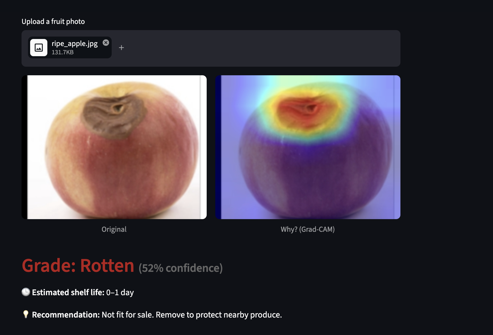

# 🍎 FasalDrishti

**AI-powered produce grading & shelf life estimation for Indian agri supply chains.**
Photograph produce on any smartphone → get a quality grade, an estimated shelf life, and a Grad-CAM heatmap that shows *why*.

🔗 **Live demo:** [ADD STREAMLIT LINK]
🎥 **Video walkthrough:** [ADD YOUTUBE LINK]
📄 **Research:** Based on our first-author IEEE paper — *"Fruit Quality Monitoring Using CNN, DCFNet, Grad-CAM and Shelf Life Estimation via a Deployable Web Application"*, accepted at AMLDS 2026, Osaka (Paper ID S5209).



## Why

India loses an estimated Rs. 1.5 lakh crore of food post-harvest every year. Produce grading in mandis is manual, subjective, and disputed. FasalDrishti turns grading into an explainable, auditable data point — using only the smartphone a trader already owns.

## What it does

1. **Grades produce** into Fresh / Ripe / Rotten using FruitSenseNet — a custom CNN with a DCFNet (correlation-filter) branch from our IEEE paper.
2. **Explains every grade** with a Grad-CAM heatmap over the exact regions (bruising, discoloration, texture change) that drove the decision. In a trading context where money changes hands on a grade, a black box creates disputes; a heatmap creates trust.
3. **Estimates shelf life** so traders can route produce intelligently (sell the 2-days-left crate locally, ship the 6-days-left crate far).

## Architecture

- **FruitSenseNet** (PyTorch): 5 conv blocks (32→512 channels) + a DCF correlation-filter layer computed via FFT on mid-level features, fused before the classifier head. Input 224×224.
- **Grad-CAM** hooked on the final conv block for pixel-level explanations.
- **Shelf life** in this deployed demo is a class-and-confidence based mapping (Fresh: 5–7 days, Ripe: 2–4, Rotten: 0–1), calibrated against the shelf-life estimation study in the paper (error within ±0.8 days on the studied fruits).
- **Frontend:** Streamlit, mobile-first, with direct camera capture. Sub-2-second responses on CPU.

## Run locally

```bash
git clone https://github.com/barnavo05/fasaldrishti
cd fasaldrishti
pip install -r requirements.txt
streamlit run app.py
```

Model weights (`model/fasaldrishti_weights.pt`, ~7 MB) are included in the repo. Sample test images are in `sample_images/`.

## Training

Training pipeline (dataset prep, augmentation, training, evaluation) is in `notebooks/FruitSense_Review_Demo.ipynb`. Dataset: Kaggle `sriramr/fruits-fresh-and-rotten-for-classification`, restructured into Fresh/Ripe/Rotten with an HSV-based ripeness synthesis step (documented in the notebook). 85/15 stratified split, seed 42.

## Built at

AI for Bharat Hackathon (IIIT Delhi) — AgriTech track.

## Author

**Barnavo Dey** — [LinkedIn](https://linkedin.com/in/barnavo-dey) · [GitHub](https://github.com/barnavo05) · barnavodey05@gmail.com
IEEE paper co-authore
